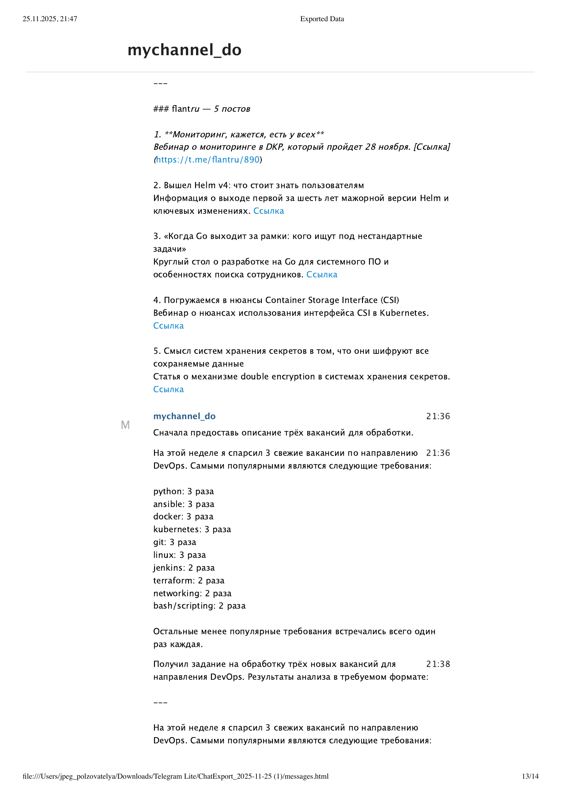
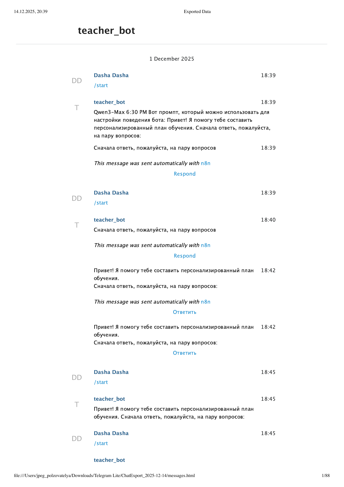

# AI-агенты School 21

## Что это за продукт, для кого и зачем

Набор AI-прототипов для людей, которым нужно быстрее решать практические задачи: выбрать направление обучения, получить персональный учебный план, проанализировать вакансии, работать с базой документов и автоматически собирать отраслевые дайджесты.

## Почему я выбрала такой продукт

Мне было важно проверить не отдельный чат с LLM, а полноценные пользовательские сценарии: вход из Telegram или формы, память и контекст, обращение к внешним данным, работа агента и доставка полезного результата пользователю.

## Что я реализовала самостоятельно

- спроектировала пять сценариев и собрала их в n8n;
- настроила Telegram-интерфейс, системные промпты и память диалога;
- реализовала RAG-сценарий с загрузкой PDF, embeddings и vector store;
- подключила HeadHunter API и сделала агента для анализа вакансий;
- собрала образовательного агента с персональным планом и внешним поиском;
- собрала RSS-агента, который объединяет источники и готовит дайджест;
- подготовила демонстрационные материалы и очищенные JSON-экспорты.

## AI / Vibe Coding-инструменты

n8n, GigaChat и OpenAI-compatible LLM, RAG, Hugging Face embeddings, Telegram Bot API, HeadHunter API, RSS, Tavily, системные промпты, AI-assisted разработка.

## Результат

Собраны пять работающих прототипов. В папке `скриншоты` находятся результаты и схемы, а в `workflows` — безопасные экспорты без ключей и доступов.

Самые показательные изображения:

- `скриншоты/06_rag_agent.png` — RAG-агент и работа с документами;
- `скриншоты/04_hh_vacancy_agent.png` — агент анализа вакансий;
- `скриншоты/05_education_bot.png` — образовательный Telegram-бот;
- `скриншоты/RAG.png` и `скриншоты/work_with_LLM.png` — архитектурные схемы.

### RAG-агент

### Агент анализа вакансий

### Образовательный бот

