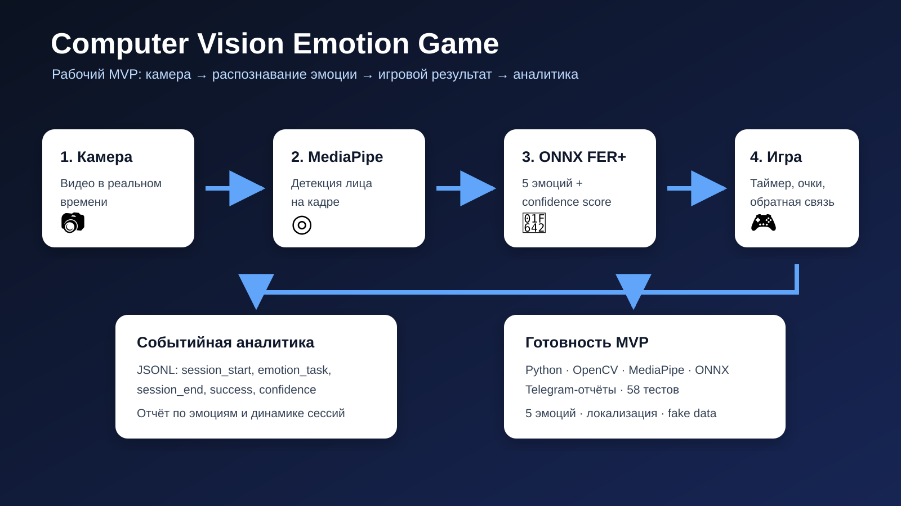
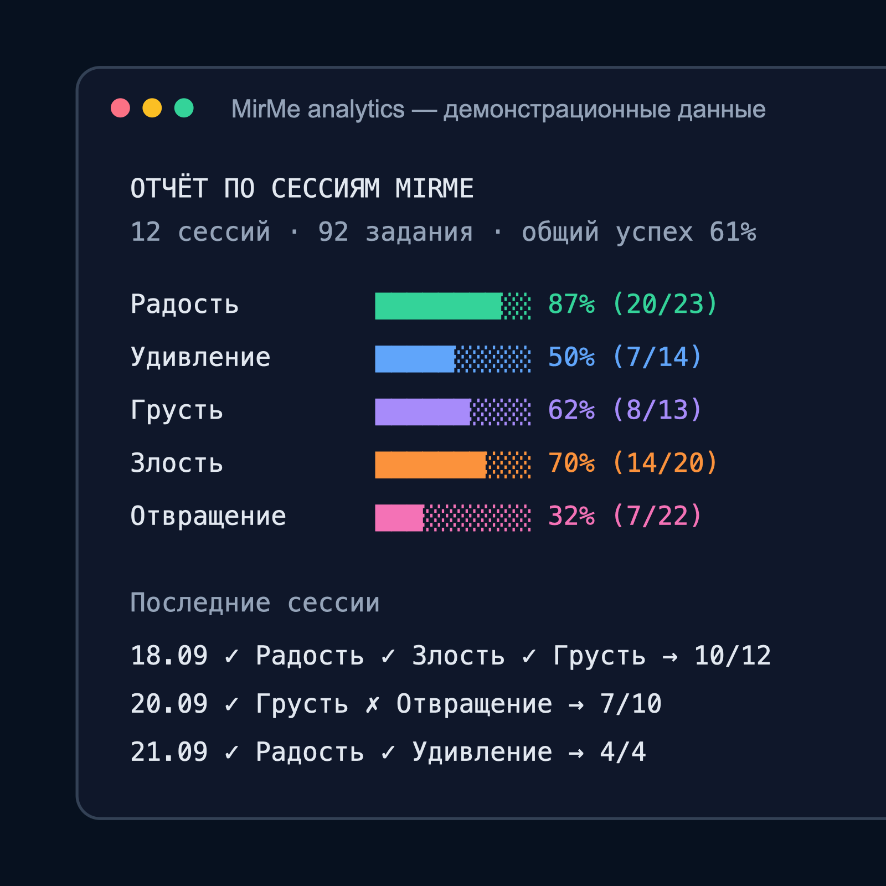

# Computer Vision Emotion Game — «Покажи эмоцию!»

## Что это за продукт, для кого и зачем

Интерактивная игра на компьютерном зрении для тренировки распознавания и выражения эмоций. Продукт создавался как часть направления Mirror Me для детей с РАС, а также как самостоятельный технический MVP, который превращает упражнение в понятный игровой сценарий с измеримым результатом.

## Почему я выбрала такой продукт

Обычное упражнение сложно повторять регулярно и объективно оценивать. Я хотела соединить камеру, распознавание эмоций, игровой цикл и аналитику так, чтобы пользователь сразу видел задачу и результат, а специалист мог оценить динамику сессий.

## Что я реализовала самостоятельно

- игровой цикл и экран настройки сессии;
- поиск лица через MediaPipe;
- классификацию пяти эмоций через ONNX-модель FER+;
- таймеры, подсказки, прогресс и итоговый экран;
- потокобезопасную запись событий в JSONL;
- генератор тестовых сессий и аналитический отчёт;
- отправку отчёта в Telegram;
- локализацию и рендеринг кириллицы;
- 58 тестов для модулей аналитики, событий, генератора данных, строк и рендеринга.

## AI / Vibe Coding-инструменты

Python, OpenCV, MediaPipe, ONNX Runtime, FER+, Pillow, pytest, Telegram Bot API и AI-assisted/Vibe Coding-разработка.

## Результат

Рабочий локальный MVP распознаёт пять эмоций, проводит сессию из трёх случайных заданий, сохраняет события и строит отчёт по успешности и динамике. В `код/reports` лежит пример отчёта, созданный на демонстрационных данных. В `скриншоты` находится его визуальная версия.

Код подготовлен для просмотра без секретов: реальные Telegram-токены и пользовательские события в пакет не включены.

## Архитектура

## Демонстрационный отчёт

