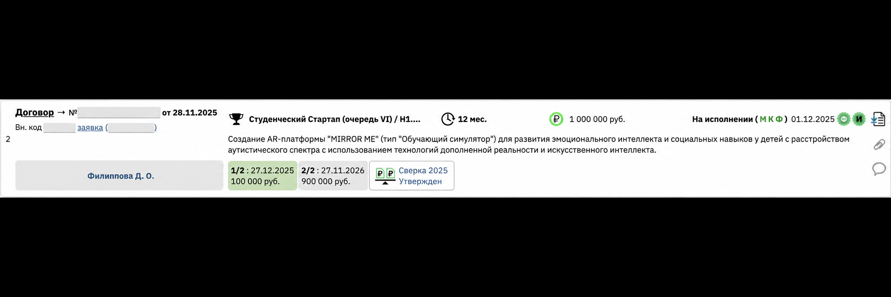
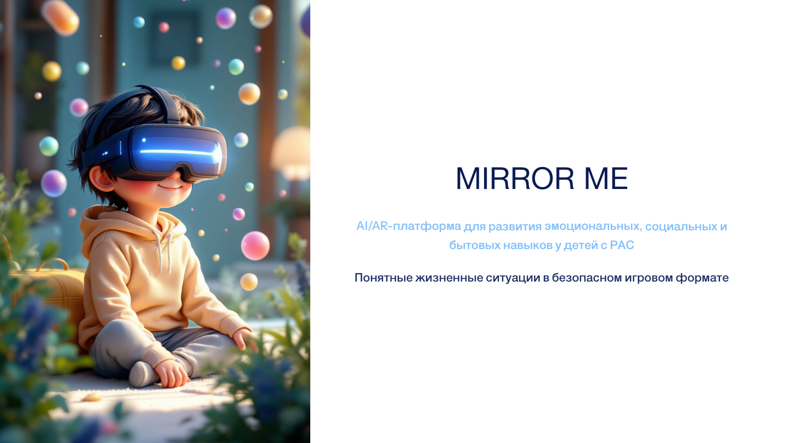
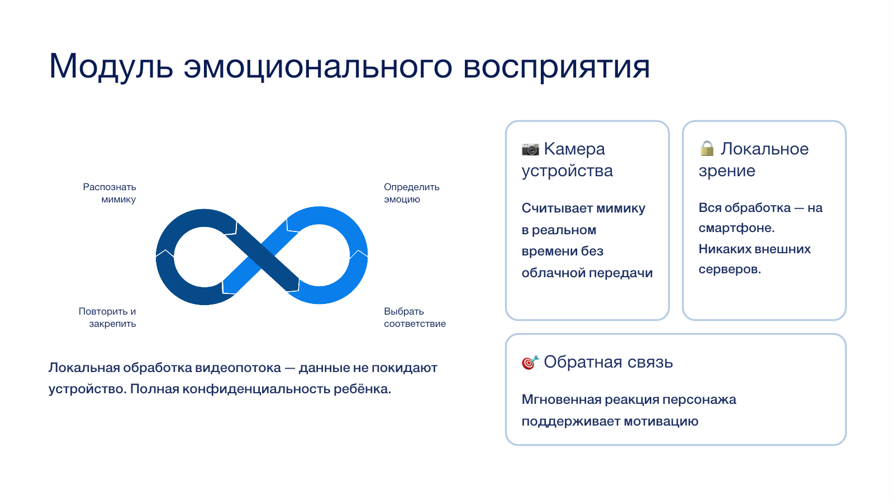
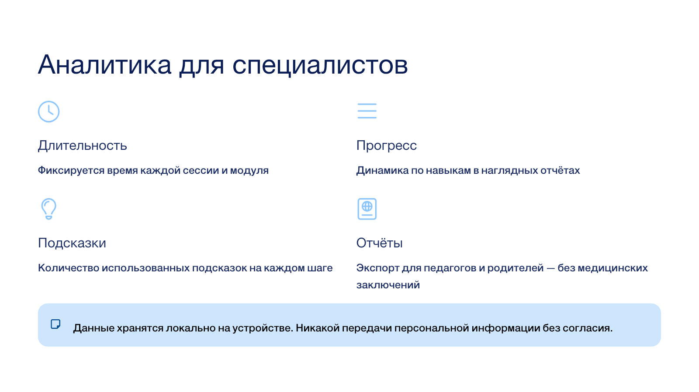
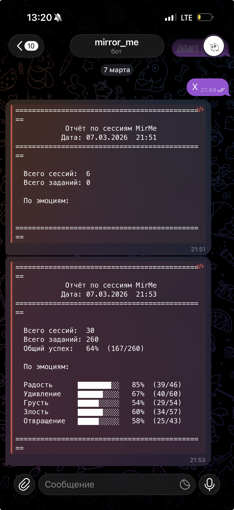

# Mirror Me — авторский AI/AR-проект

## Моя роль

Я сама придумала Mirror Me, подготовила проект к программе «Студенческий стартап» и привлекла финансирование 1 000 000 ₽. Я веду проект как основательница и руководитель разработки: определяю продуктовую стратегию и архитектуру, ставлю задачи, организую работу команды и партнёров, контролирую качество и продолжаю развивать продукт.

## Что это за продукт, для кого и зачем

Mirror Me — мой pet project и программный продукт ООО «Мауратар» для развития эмоциональных, социальных и бытовых навыков у детей с РАС. Пользователи продукта — дети, родители и специалисты. Продукт соединяет безопасные игровые сценарии, локальное компьютерное зрение, персонализацию заданий и аналитику занятий.

## Почему я решила сделать именно такой продукт

Я увидела, что семьям и специалистам не хватает доступного инструмента, который соединяет игровой формат, повторяемые упражнения и понятную фиксацию результата. Я сама придумала Mirror Me и развиваю его от пользовательской проблемы к техническому прототипу и модели внедрения.

## Что я реализовала самостоятельно

- сформулировала идею, аудиторию, пользовательские проблемы и ценностное предложение;
- разработала продуктовую стратегию, сценарии и техническую архитектуру;
- спроектировала AI/AR-сценарии, компьютерное зрение и событийную аналитику;
- собрала и развивала прототипы, сайт и продуктовые материалы;
- реализовала Telegram-отчётность по сессиям и эмоциям;
- готовила финансовую модель, грантовую заявку и партнёрские предложения;
- в раннем VR-прототипе организовала команду из трёх человек и отвечала за ТЗ, сроки, качество и продуктовую часть;
- продолжаю вести проект как основательница и руководитель разработки.

## AI / Vibe Coding-инструменты

AI-assisted и Vibe Coding-разработка, Python, OpenCV, MediaPipe, ONNX, React, TypeScript, Vite, AR/VR-инструменты, событийная аналитика, API и прототипирование пользовательских сценариев.

## Результат

- самостоятельно подготовила проект к программе **«Студенческий стартап»**, победила и привлекла финансирование 1 000 000 ₽;
- программа зарегистрирована в Роспатенте;
- создан Computer Vision MVP и событийная аналитика;
- реализован демонстрационный Telegram-отчёт по сессиям и пяти эмоциям;
- опубликованы сайты [edumirrorme.ru](https://edumirrorme.ru) и [mauratar.tech](https://mauratar.tech/);
- подготовлены продуктовая концепция, архитектура, презентации и материалы для пилотов.

## Доказательства и визуальные материалы

На скриншоте финансирования скрыты номер договора и код заявки. Сохранены название программы, описание Mirror Me, сумма и график финансирования.

Приватные юридические, финансовые и персональные документы в портфолио не включены.
