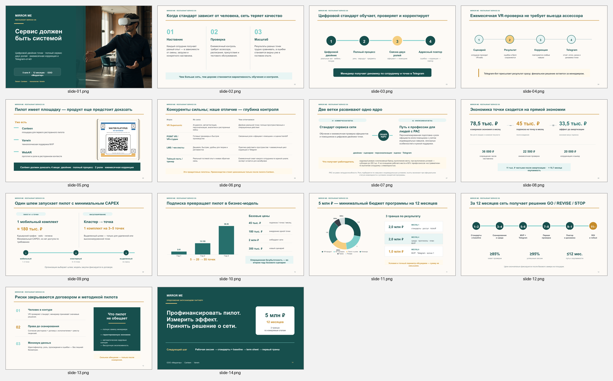

# Mirror Me — XR/AI-платформа

## Что это за продукт, для кого и зачем

Mirror Me — XR/AI-платформа для развития эмоциональных, социальных и бытовых навыков у детей с РАС. Пользователи продукта — дети, родители и специалисты. Идея продукта состоит в безопасных интерактивных сценариях, персонализации заданий и аналитике занятий.

## Почему я решила сделать именно такой продукт

Я увидела, что семьям и специалистам не хватает доступного инструмента, который соединяет игровой формат, повторяемые упражнения и понятную фиксацию результата. Я сама придумала концепцию Mirror Me и начала развивать её от пользовательской проблемы к техническому прототипу и модели внедрения.

## Что я реализовала самостоятельно

- сформулировала идею, аудиторию, пользовательские проблемы и ценностное предложение;
- разработала продуктовую стратегию, сценарии и техническую архитектуру;
- спроектировала AI/AR/VR-сценарии, компьютерное зрение и событийную аналитику;
- собрала и развивала прототипы, сайт и продуктовые материалы;
- готовила финансовую модель, грантовые заявки и партнёрские предложения;
- в раннем VR-прототипе организовала команду из трёх человек и отвечала за ТЗ, сроки, качество и продуктовую часть;
- продолжаю вести проект как основательница и технический руководитель.

## AI / Vibe Coding-инструменты

AI-assisted и Vibe Coding-разработка, Python, OpenCV, MediaPipe, ONNX, React, TypeScript, Vite, AR/VR-инструменты, событийная аналитика, API и прототипирование пользовательских сценариев.

## Результат

- проект **дважды получил финансирование** — через «Студенческий стартап» и «Создай НАШЕ»;
- программа зарегистрирована в Роспатенте;
- создан работающий Computer Vision MVP и событийная аналитика;
- опубликован сайт: <https://edumirrorme.ru>;
- подготовлены продуктовая концепция, архитектура, презентации и материалы для пилотов и партнёров.

Изображения в папке `скриншоты` показывают продуктовую презентацию и XR-концепцию. Приватные финансовые, юридические и персональные документы в портфолио не включены.

## Визуальные материалы

