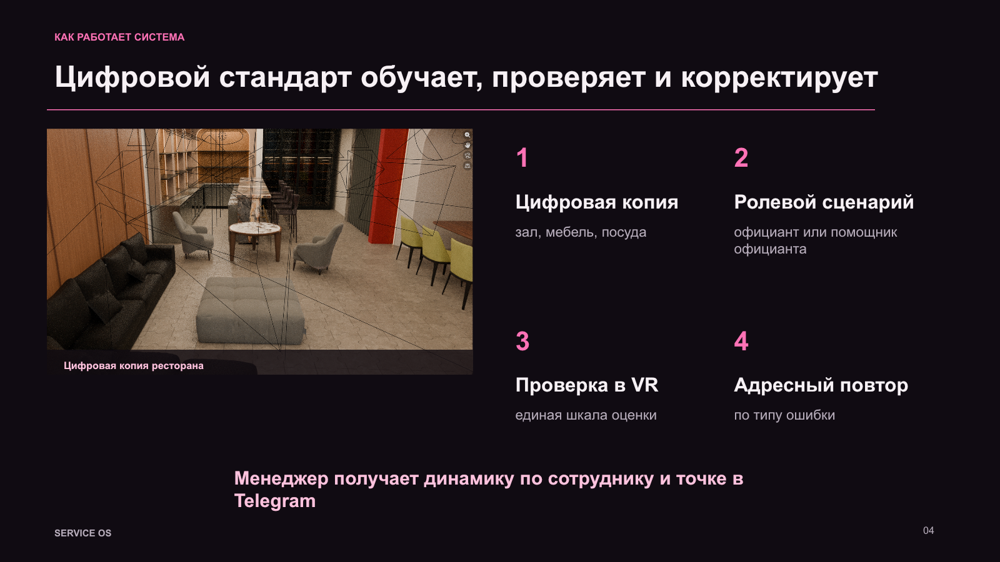
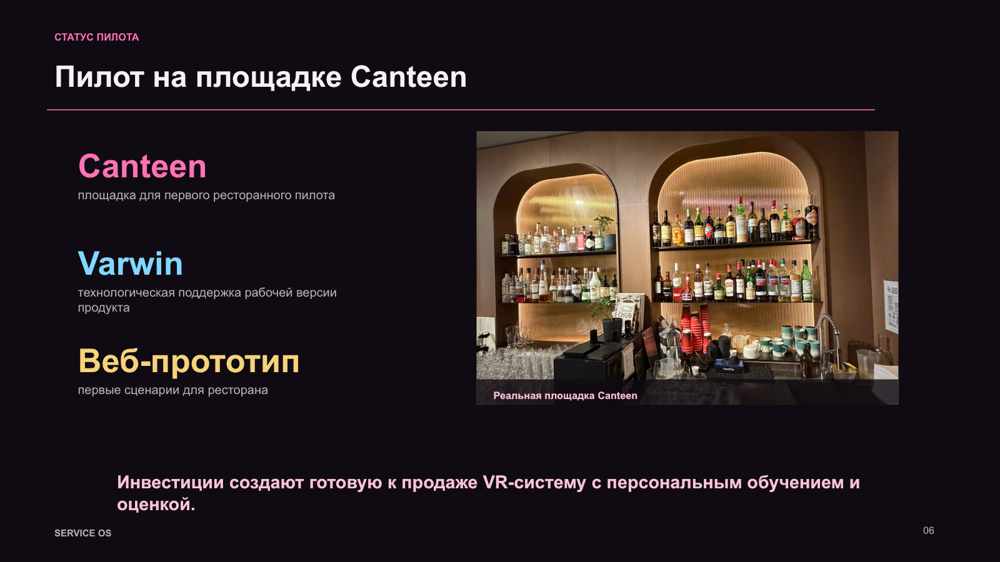
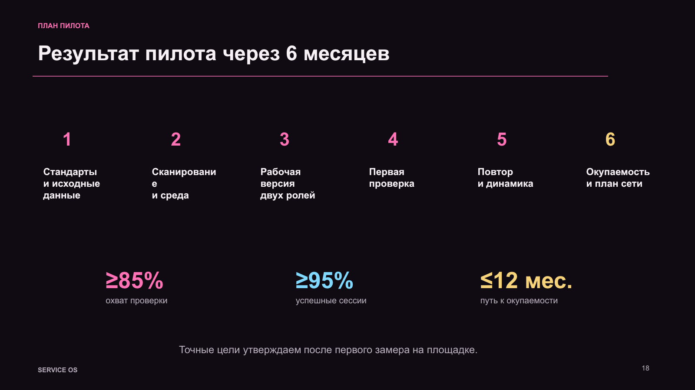
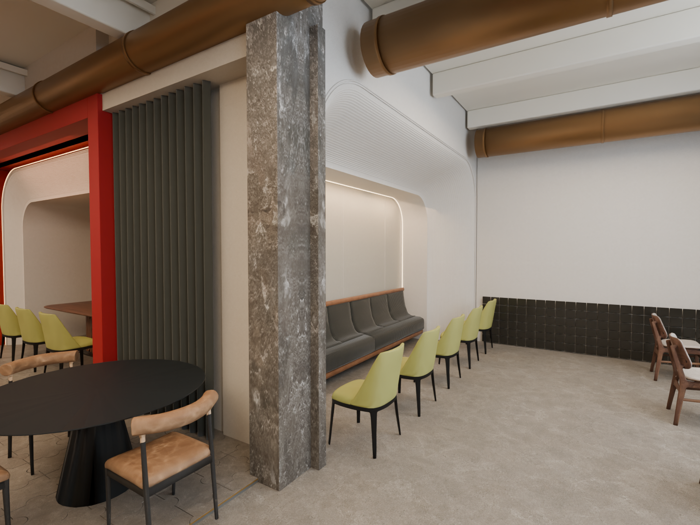
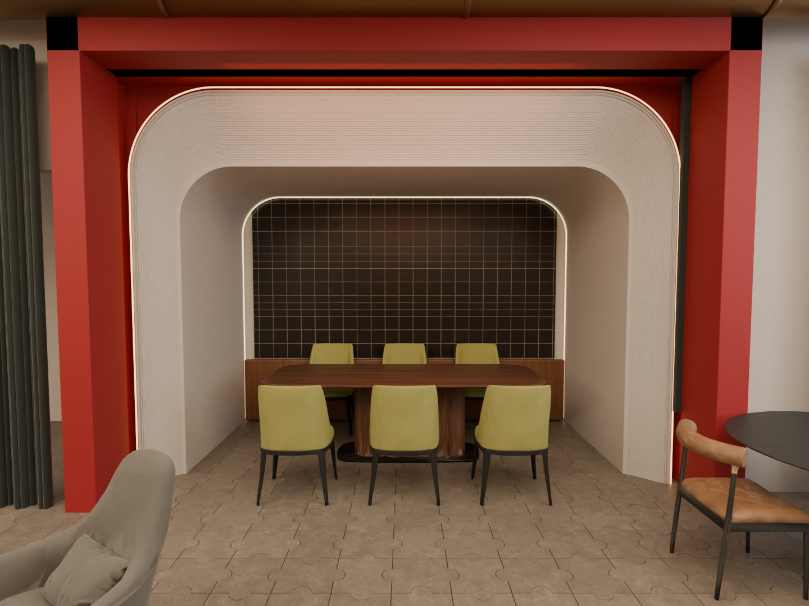
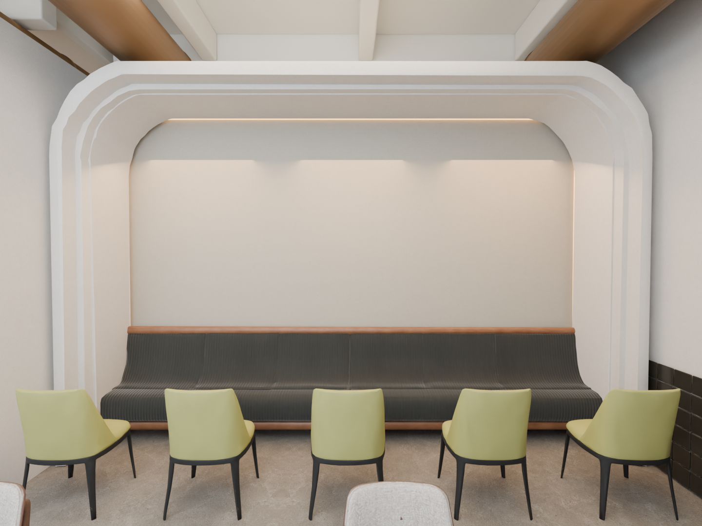
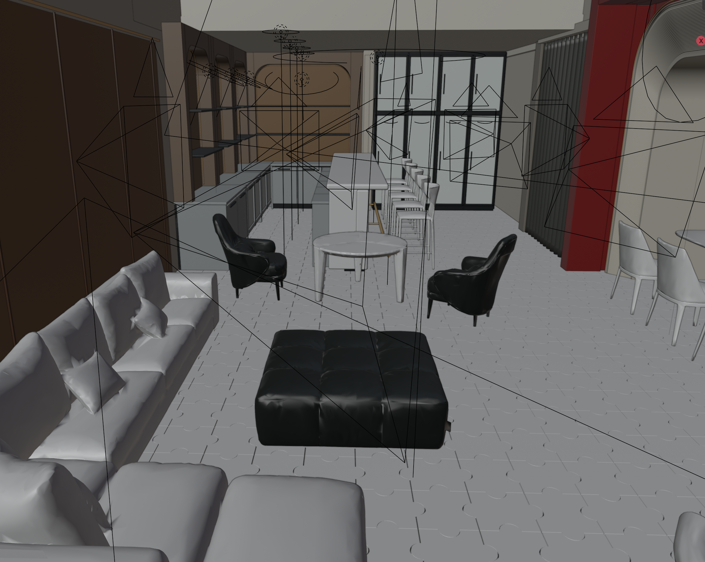
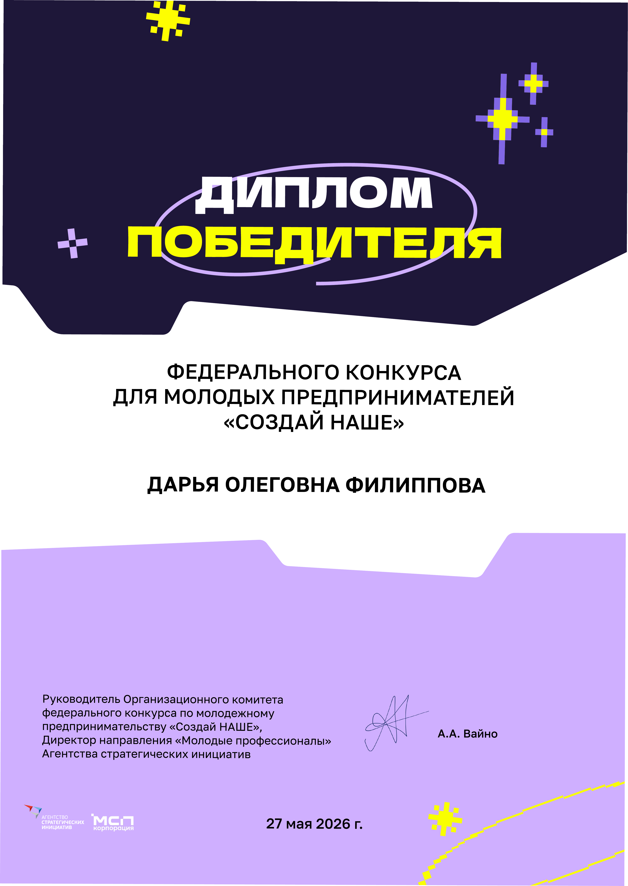
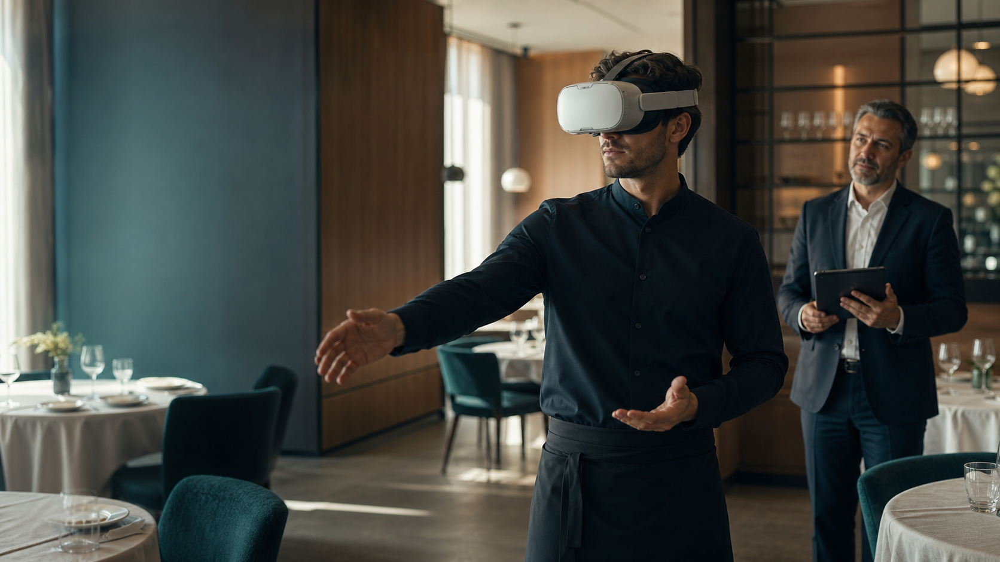

# Service OS — VR-система управления сервисом

## Моя роль

Я самостоятельно придумала Service OS, превратила идею в продуктовую концепцию, подготовила проект к конкурсу и получила финансирование. Сейчас я веду развитие продукта как инициатор, product lead и руководитель разработки: определяю приоритеты, формирую требования, координирую технологическую часть и отвечаю за подготовку пилота.

## Что это за продукт, для кого и зачем

Service OS — отдельный от Mirror Me pet project для ресторанных сетей. Продукт переводит стандарты сервиса в повторяемый цифровой сценарий: сотрудник тренируется в VR, проходит регулярную проверку, получает адресный повтор по типу ошибки, а менеджер видит результат и динамику.

Дополнительная ветка продукта помогает заранее планировать банкетные пространства, рассадку, проходы, сервировку и выездные мероприятия в цифровой копии площадки.

## Почему я решила сделать именно такой продукт

В ресторанной сети качество обучения часто зависит от конкретного наставника, загрузки смены и доступности проверяющего. Из-за этого результаты разных точек трудно сравнивать. Я решила превратить стандарт обслуживания в измеримый продуктовый сценарий, который можно повторять без давления реальной смены.

## Что я реализовала самостоятельно

- придумала продукт и сформулировала проблему ресторанной сети;
- разработала пользовательские роли, сценарий обучения и проверочный цикл;
- спроектировала цифровую копию ресторана и 3D-пространство;
- подготовила сценарий пилота на шесть месяцев и критерии проверки;
- рассчитала unit-экономику, модель подписки и бюджет пилота;
- подготовила конкурсные и инвестиционные материалы;
- веду разработку VR-компонента и интеграцию с Varwin;
- развиваю продукт через своё ООО «Мауратар» и отвечаю за продуктовые решения.

## Инструменты

Product Discovery, CJM и ролевые сценарии, Blender и 3D-прототипирование, Varwin, VR, Telegram-аналитика, веб-прототипирование, финансовое моделирование и AI-assisted/Vibe Coding-разработка.

## Финансирование и результат

- самостоятельно подготовила проект к федеральному конкурсу **«Создай НАШЕ»**, стала победителем и получила финансирование;
- создала 3D-цифровую копию ресторанного пространства;
- подготовила продуктовый сценарий, модель регулярной проверки и адресного повторения навыков;
- сформировала план пилота, целевые метрики и экономику внедрения;
- веду подготовку первой ресторанной апробации и технологическую ветку Varwin.

Диплом подтверждает персональную победу Дарьи Олеговны Филипповой в конкурсе «Создай НАШЕ». Название проекта в дипломе не указано; связь диплома с Service OS дана на основании информации автора проекта.

## Текущий статус

**Проект находится в разработке под моим руководством.** 3D-концепция, продуктовый сценарий, веб-прототип и пилотные материалы подготовлены. Компонент на Varwin и рабочая VR-версия развиваются. Плановые KPI, бюджет пилота 5 млн ₽ и расчёт экономики из презентации не выдаются за уже достигнутые показатели.

Компания и публичная информация: [mauratar.tech](https://mauratar.tech/)

## Визуальные материалы

