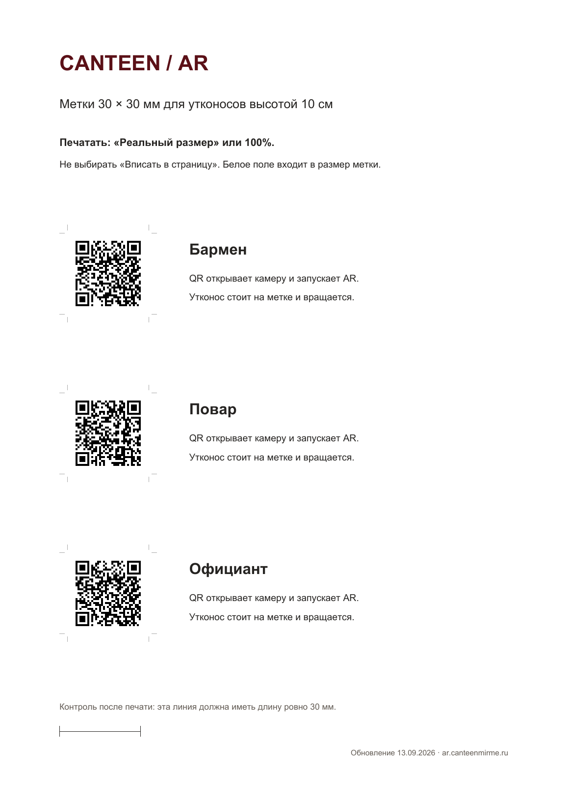
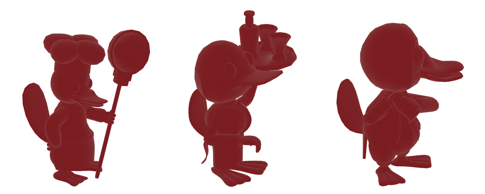

# Canteen × Mirror Me × VARWIN — благотворительный AR-десерт

## Коротко

Инклюзивный гастрономический WebAR-проект: гость ресторана сканирует съедобный QR-код камерой телефона и видит в дополненной реальности одного из трёх 3D-персонажей ресторанных профессий — повара, официанта или бармена. NFC-метка на карточке открывает историю автора персонажей, информацию о проекте и возможность поддержать сбор на VR-комплект для обучения подростков ресторанным профессиям.

**Статус:** техническая часть собрана и опубликована; для запуска в ресторане осталось итоговое согласование с площадкой Canteen. Просмотр работает в браузере по QR-метке — устанавливать приложение не нужно.

## Моя роль — автор идеи и руководитель проекта

Я веду проект целиком: сформулировала концепцию и социальную задачу, собрала продуктовый сценарий, определила механику QR/NFC и путь гостя, поставила технические задачи, координирую партнёров и участников, контролирую готовность WebAR-части и вывожу продукт к пилоту в ресторане.

3D-персонажей ресторанных профессий создал Роман Александров — 3D-моделлер с РАС. Я отвечаю за то, чтобы его работа стала частью понятного, работающего и социально полезного продукта.

## Для кого и зачем

- Для гостей Canteen — необычный интерактивный опыт прямо во время заказа десерта.
- Для подростков с РАС — понятный и бережный вход в знакомство с ресторанными профессиями.
- Для ресторана и партнёров — формат, который соединяет гостевой опыт, инклюзию и измеримую благотворительную цель.

## Почему именно такой продукт

Я выбрала лёгкий вход через десерт: QR находится на самом продукте, поэтому человеку не нужно искать отдельный сервис или устанавливать приложение. AR-взаимодействие происходит через камеру браузера, а NFC расширяет сценарий — от впечатления гостя к истории автора и поддержке обучения.

## Что реализовано

- три публичные WebAR-сцены для ролей «повар», «официант», «бармен»;
- QR-метки, ведущие на HTTPS-страницы с запуском камеры;
- привязка 3D-персонажа к физической метке, скрытие модели при потере метки и анимация вращения;
- печатный макет меню и лист QR-меток 30 × 30 мм;
- NFC-сценарий для истории автора, информации о проекте и благотворительного сбора;
- проверка сценариев в браузере; перед тиражной печатью остаётся финальная проверка на устройствах площадки.

## Инструменты

WebAR, JavaScript, A-Frame, QR/NFC, 3D-модели, продуктовая аналитика и AI/Vibe Coding-инструменты для быстрого проектирования и проверки технических гипотез.

## Результат и текущая стадия

Техническая сборка готова и имеет публичную точку входа. Следующий шаг — итоговое согласование с рестораном и запуск на площадке. Это не презентационный макет: QR ведут на WebAR-страницы, которые открываются в браузере телефона.

- [Открыть WebAR: бармен](https://ar.canteenmirme.ru/ar3.html?role=barman)
- [Открыть WebAR: повар](https://ar.canteenmirme.ru/ar3.html?role=cook)
- [Открыть WebAR: официант](https://ar.canteenmirme.ru/ar3.html?role=waiter)

## Партнёры

Ресторан **Canteen**, **Mirror Me**, XR-платформа **VARWIN**.

## Скриншоты

### Меню и пользовательский сценарий

### Печатные QR-метки

### 3D-персонажи ресторанных профессий

## Граница публикации

В репозиторий добавлены только визуальные материалы и публичные URL. Исходный пакет развёртывания, доступы к хостингу и служебная конфигурация не публикуются.
