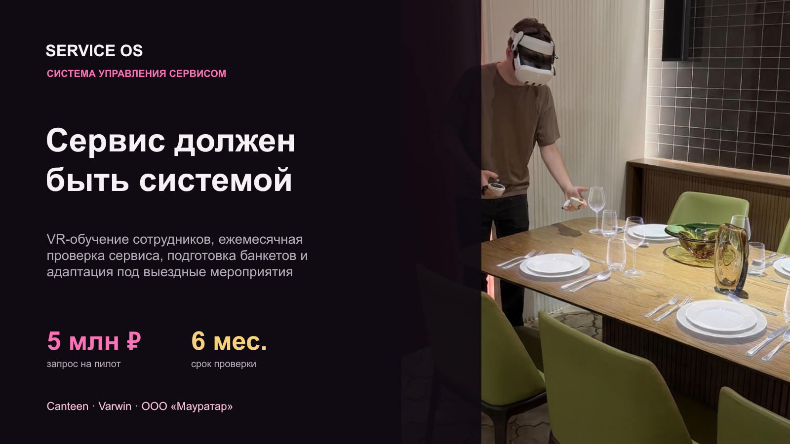
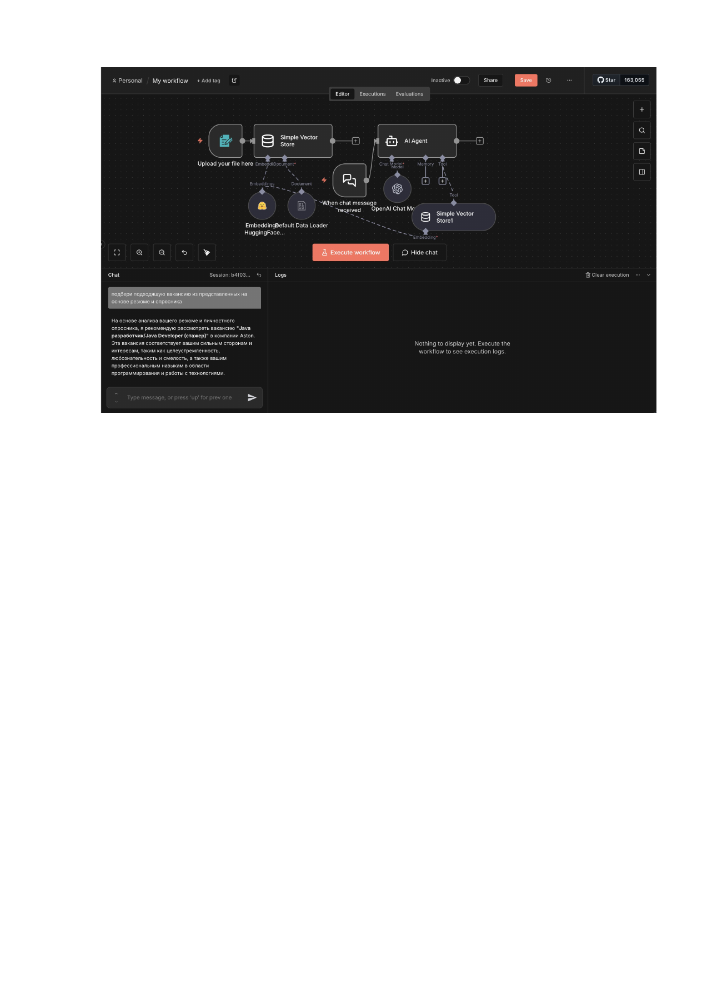
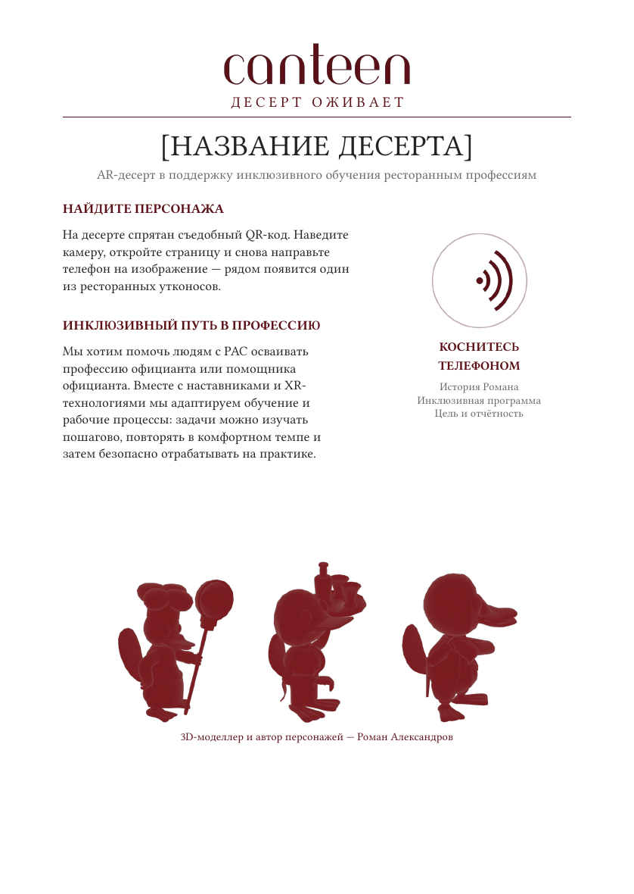

# Дарья Филиппова — AI Product Builder

Портфолио для вакансии **AI Intern Product Manager / AI Product Builder (Vibe Coding)**.

Я самостоятельно превращаю идею и пользовательскую проблему в работающий MVP: исследую контекст, формулирую ценность, проектирую пользовательский сценарий и техническую архитектуру, собираю прототип с AI/Vibe Coding-инструментами, подключаю аналитику и готовлю продукт к пилоту.

## Основательская и руководящая роль

В ключевых проектах я выступаю не исполнителем отдельной задачи, а автором и старшей на проекте. Я сама создаю концепцию, привлекаю финансирование, определяю продуктовые и технические приоритеты, формирую ТЗ, организую работу участников и отвечаю за развитие продукта. Mirror Me получил 1 000 000 ₽ по программе «Студенческий стартап», а Service OS получил финансирование после моей победы в конкурсе «Создай НАШЕ».

## 1. Mirror Me — авторский AI/AR-проект

Pet project для развития эмоциональных, социальных и бытовых навыков у детей с РАС. Я придумала концепцию, привлекла финансирование, сформулировала продуктовую стратегию и техническую архитектуру, разработала прототипы и продолжаю вести продукт как основательница и руководитель разработки.

Mirror Me победил в программе **«Студенческий стартап» и получил финансирование 1 000 000 ₽**. Программа зарегистрирована в Роспатенте. В кейсе показаны модуль компьютерного зрения, Telegram-аналитика и подтверждение финансирования с закрытыми служебными идентификаторами.

[Описание и доказательства](03_mirror_me/README.md) · [Публичная версия](https://edumirrorme.ru)

## 2. Service OS — профинансированный pet project

Отдельный от Mirror Me продукт для ресторанного бизнеса: VR-обучение сотрудников, регулярная проверка стандарта сервиса, адресное повторение слабых навыков и подготовка банкетных пространств через цифровую копию ресторана.

Я самостоятельно подготовила проект к федеральному конкурсу **«Создай НАШЕ»**, стала победителем и получила финансирование. Я разработала продуктовую концепцию, сценарий пилота, 3D-прототип, экономику и презентацию и продолжаю вести разработку. Компонент на Varwin находится в работе; готовая промышленная версия пока не заявляется.

[Описание, рендеры и подтверждение победы](04_service_os/README.md)

## 3. AI-агенты School 21

Пять прототипов на n8n: Telegram AI-ассистент, RAG-агент, анализатор вакансий, образовательный бот и агент для подготовки контент-дайджестов. Я самостоятельно проектировала сценарии, системные промпты, память, маршрутизацию, интеграции с API и пользовательские цепочки.

[Описание, скриншоты и безопасные workflow](01_school21_ai_agents/README.md)

## Дополнительный продуктовый кейс: Canteen × Mirror Me × VARWIN

Инклюзивный WebAR-десерт для ресторана Canteen: QR на десерте запускает через браузер AR-персонажа ресторанной профессии, а NFC раскрывает историю автора и благотворительный сценарий. Я автор идеи и руководитель проекта: веду концепцию, пользовательский путь, координацию партнёров и техническую реализацию. Техническая часть готова; для пилота осталось итоговое согласование с рестораном.

[Описание, скриншоты и публичные WebAR-ссылки](05_canteen_ar_dessert/README.md)

## Дополнительные технические проекты

### Computer Vision Emotion Game

Python-MVP игры на компьютерном зрении: MediaPipe, ONNX FER+, игровой сценарий, JSONL-события, аналитика и Telegram-отчёты. Подготовлено 58 тестов по пяти модулям.

[Код и демонстрация](02_computer_vision_emotion_game/README.md)

### Linux Monitoring v2.0

Учебный инфраструктурный проект School 21: 31 Bash-скрипт, генерация и анализ логов, GoAccess, Prometheus, Grafana и сетевые проверки. Исходники прошли синтаксическую проверку; запуск опасных сценариев генерации файлов в публичной проверке не выполнялся.

[Описание и исходники](06_linux_monitoring/README.md)

## Mauratar

**ООО «Мауратар» — моя компания**, в которой я являюсь генеральным директором и руководителем разработки. Компания создаёт программные решения на основе XR, AR и AI и сопровождает их внедрение. Mirror Me и Service OS остаются отдельными авторскими продуктами.

[mauratar.tech](https://mauratar.tech/)

## Дополнительные сильные стороны

- Product Discovery, MVP, продуктовая стратегия и пользовательские сценарии;
- Python, Bash, API, Git/GitHub, FastAPI, PostgreSQL и Docker;
- n8n, RAG, prompt engineering, GigaChat и Telegram Bot API;
- OpenCV, MediaPipe, ONNX, Blender, Varwin и событийная аналитика;
- React, TypeScript, Vite и прототипирование интерфейсов;
- грантовые заявки, презентации, финансовые модели и материалы для партнёров;
- организация небольшой команды и ответственность за продукт от идеи до результата.

## Безопасность публикации

В публичную подборку не включены рабочие пароли, токены, chat ID, webhook ID, банковские реквизиты и приватные документы. В подтверждении финансирования Mirror Me закрыты номер договора и код заявки. Workflow содержат только безопасные placeholders.
